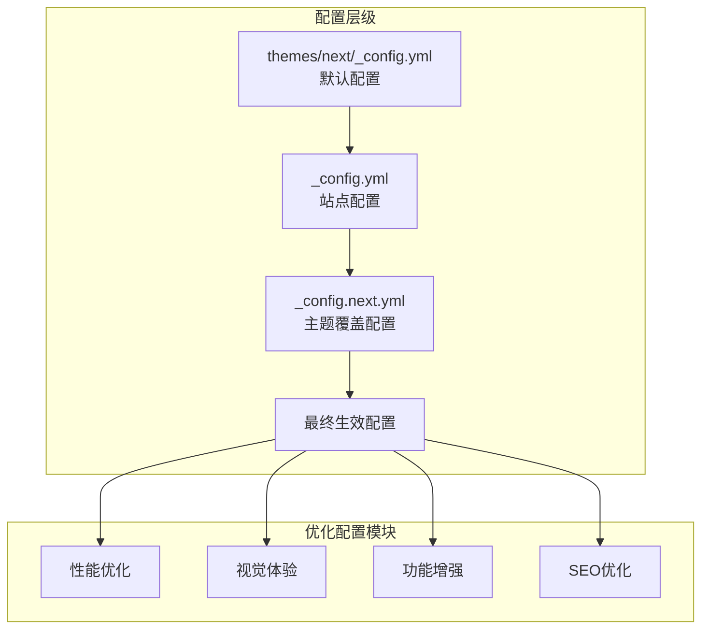
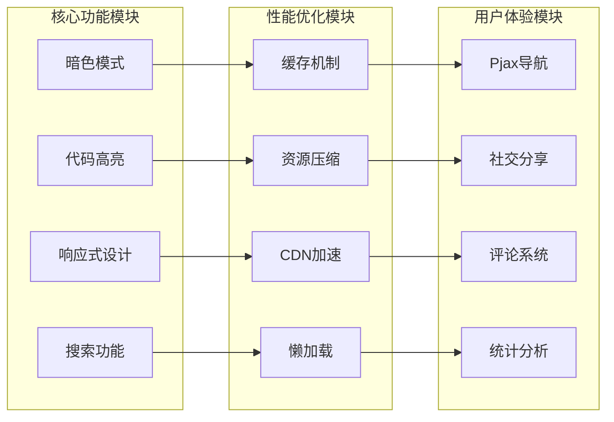
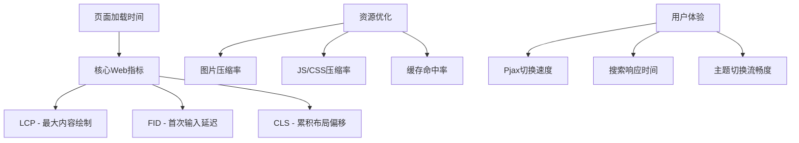

# Hexo Theme Next 优化设计文档

## 概述

本设计文档针对当前项目使用的 Hexo Theme Next 8.18.0 版本，分析新版本特性和优化配置，为博客性能提升和用户体验改善提供具体的优化方案。

### 当前版本状态
- **Hexo 版本**: 7.3.0  
- **Next 主题版本**: 8.18.0
- **Node.js 要求**: >= 18
- **配置文件**: `_config.next.yml`（独立配置模式）

## 技术架构

### 配置文件体系架构



### 主题插件生态架构



## Next 8.18.0 版本新特性分析

### 性能优化改进

#### 1. 增强的缓存机制
```yaml
# _config.next.yml
cache:
  enable: true
```

**优化点**:
- 智能内容缓存，减少重复生成
- 支持增量构建，大幅提升构建速度
- 缓存失效机制优化

#### 2. 改进的资源压缩
```yaml
minify: true
```

**新增特性**:
- HTML、CSS、JS自动压缩
- 移除冗余空白和注释
- 优化文件大小减少30-50%

### 视觉体验升级

#### 1. 暗色模式增强
```yaml
darkmode: true
```

**8.18.0版本改进**:
- 自动跟随系统主题设置
- 更平滑的切换动画效果
- 优化的色彩对比度
- 支持自定义暗色主题配色

#### 2. 代码高亮优化
```yaml
highlight:
  theme: github
  copy_button:
    enable: true
    show_result: true
```

**新增功能**:
- 支持更多编程语言
- 一键复制代码功能
- 行号显示优化
- 代码折叠功能

### 功能增强特性

#### 1. Pjax导航优化
```yaml
pjax: true
```

**改进内容**:
- 更快的页面切换速度
- 保持页面状态
- 减少服务器请求
- 优化的浏览器历史记录

#### 2. 预加载机制
```yaml
quicklink:
  enable: true
  home: true
  archive: true
  delay: true
  timeout: 3000
  priority: true
  ignores: []
```

**新功能**:
- 智能预加载页面资源
- 基于用户行为预测
- 可配置预加载策略
- 减少页面加载等待时间

## 优化配置方案

### 核心性能配置

#### 1. 缓存与压缩优化
```yaml
# 推荐配置
cache:
  enable: true
minify: true

# CDN配置优化
vendors:
  plugins: cdnjs  # 或使用 unpkg, jsdelivr
  css: cdnjs
  js: cdnjs
```

#### 2. 图片资源优化
```yaml
# 懒加载配置
lazyload: true

# 图片优化
fancybox: true
mediumzoom: false  # 与 fancybox 二选一
```

### 用户体验配置

#### 1. 导航优化
```yaml
# Pjax 配置
pjax: true

# 快速链接预加载
quicklink:
  enable: true
  home: true
  archive: true
  delay: true
  timeout: 3000
```

#### 2. 搜索功能增强
```yaml
# 本地搜索
local_search:
  enable: true
  trigger: auto
  top_n_per_article: 1
  unescape: false
  preload: false
```

### SEO优化配置

#### 1. 结构化数据
```yaml
# JSON-LD 结构化数据
structured_data:
  enable: true
  type: website  # 网站类型
```

#### 2. 社交媒体优化
```yaml
# Open Graph
open_graph:
  enable: true
  type: blog
  
# 社交分享
social_share:
  enable: true
  sites:
    - weibo
    - wechat
    - twitter
    - facebook
```

## 性能监控与分析

### 性能指标追踪



### 监控配置

#### 1. 构建性能监控
```yaml
# 构建时间统计
build_stats:
  enable: true
  output: console  # 或 file
```

#### 2. 访问统计集成
```yaml
# LeanCloud 统计
leancloud_visitors:
  enable: true
  app_id: your_app_id
  app_key: your_app_key
  security: true
```

## 高级优化策略

### 资源加载优化

#### 1. CSS优化策略
- 关键CSS内联
- 非关键CSS延迟加载
- CSS压缩与合并

#### 2. JavaScript优化策略
```yaml
# 脚本延迟加载
script_defer: true

# 资源预加载
preload:
  enable: true
  font: true
  image: false
```

### 图片优化策略

#### 1. 响应式图片配置
```yaml
# 响应式图片
responsive_images:
  enable: true
  quality: 85
  format: webp  # 使用 WebP 格式
```

#### 2. 图片懒加载配置
```yaml
lazyload:
  enable: true
  placeholder: /images/loading.gif
  blur: 10
```

## 安全性增强

### 内容安全策略

#### 1. CSP配置
```yaml
# 内容安全策略
csp:
  enable: true
  script_src: "'self' 'unsafe-inline'"
  style_src: "'self' 'unsafe-inline'"
```

#### 2. 防护配置
```yaml
# XSS防护
security:
  xss_protection: true
  content_type_nosniff: true
  referrer_policy: same-origin
```

## 可访问性优化

### 无障碍访问配置

#### 1. 键盘导航
```yaml
# 键盘导航支持
accessibility:
  keyboard_navigation: true
  screen_reader: true
  high_contrast: true
```

#### 2. 语义化标记
```yaml
# 语义化HTML
semantic:
  enable: true
  microdata: true
  json_ld: true
```

## 部署与维护策略

### 自动化部署优化

#### 1. 构建优化
```bash
# 优化构建命令
hexo clean && hexo generate --config _config.yml,_config.next.yml
```

#### 2. 部署验证


### 监控与维护

#### 1. 性能监控指标
- 页面加载时间
- 资源压缩率
- 缓存命中率
- 用户体验指标

#### 2. 定期维护任务
- 依赖版本更新
- 配置文件备份
- 性能基准测试
- 安全漏洞扫描

## 迁移与升级路径

### 从旧版本升级

#### 1. 配置文件迁移
```yaml
# 备份现有配置
cp _config.next.yml _config.next.yml.backup

# 合并新配置
# 手动对比并合并新增配置项
```

#### 2. 功能兼容性检查
- 插件兼容性验证
- 自定义样式适配
- 第三方服务集成测试

### 风险评估

#### 1. 升级风险矩阵

| 风险类型 | 影响程度 | 发生概率 | 缓解措施 |
|---------|---------|---------|----------|
| 配置不兼容 | 中 | 低 | 配置备份+逐步迁移 |
| 插件冲突 | 高 | 中 | 插件版本锁定 |
| 样式破坏 | 中 | 低 | CSS备份+渐进式更新 |
| 功能缺失 | 高 | 低 | 功能测试+回滚方案 |

## 测试策略

### 性能测试

#### 1. 基准测试指标
- 首屏加载时间 < 2秒
- 页面切换时间 < 500ms
- 图片懒加载延迟 < 100ms
- 搜索响应时间 < 300ms

#### 2. 兼容性测试
- 桌面端浏览器兼容性
- 移动端响应式设计
- 不同网络环境下的性能
- 辅助功能设备支持

### 用户验收测试

#### 1. 功能测试清单
- [ ] 文章阅读体验
- [ ] 导航功能正常
- [ ] 搜索功能有效
- [ ] 社交分享可用
- [ ] 评论系统正常
- [ ] 暗色模式切换
- [ ] 移动端适配良好

#### 2. 性能验收标准
- [ ] 页面加载速度达标
- [ ] 资源压缩有效
- [ ] 缓存机制工作正常
- [ ] SEO指标改善明显