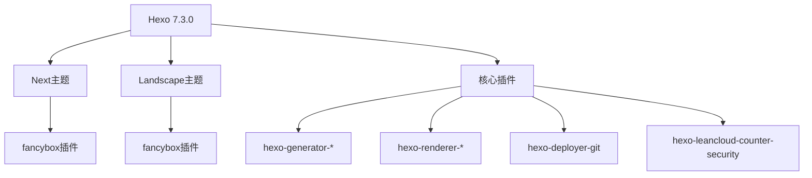
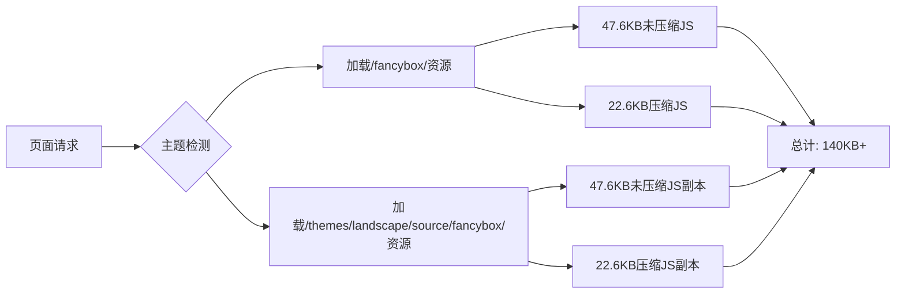
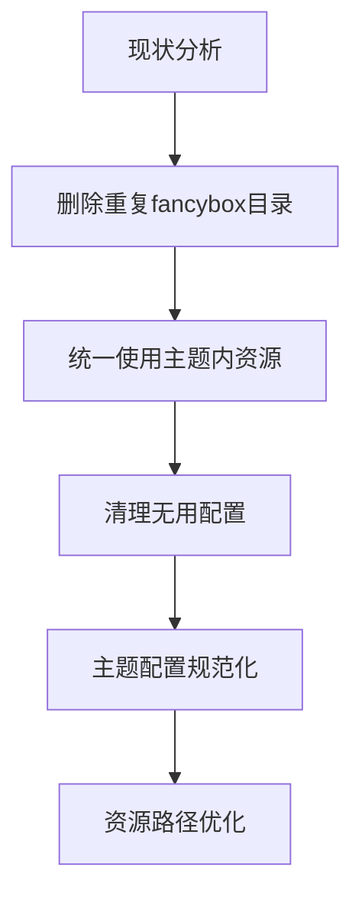
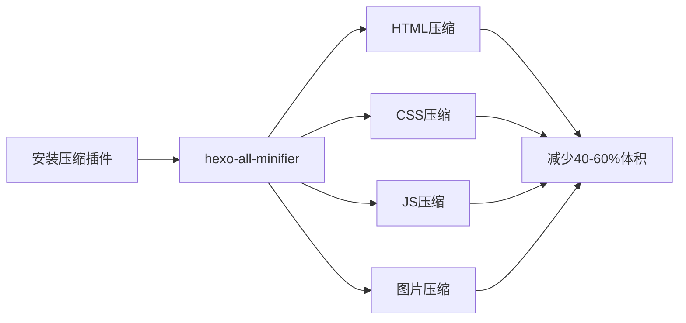
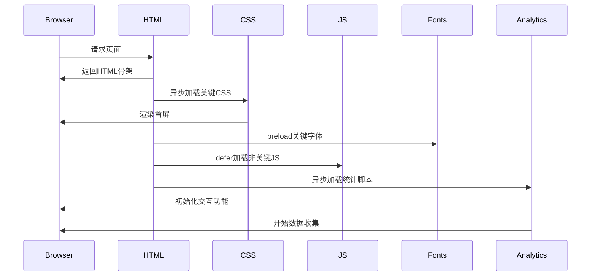
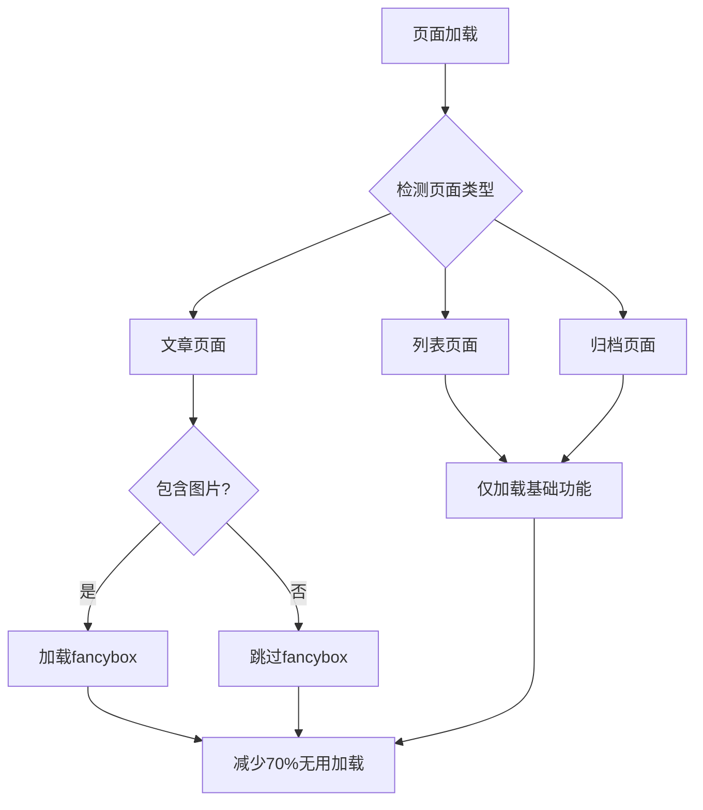
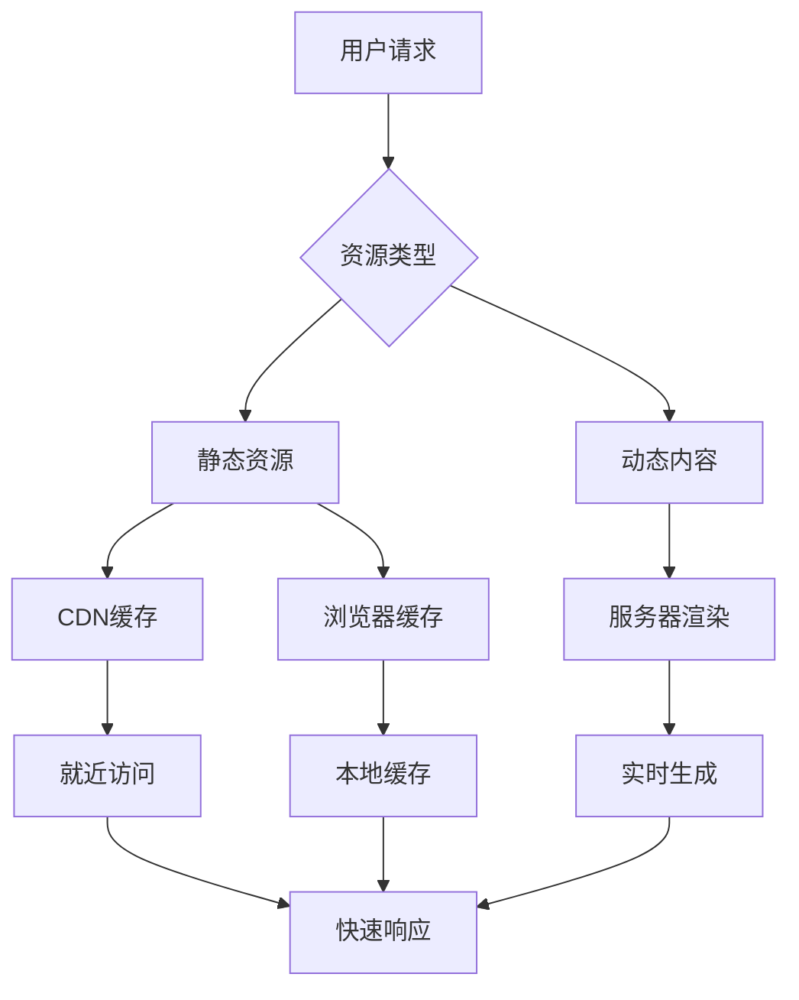
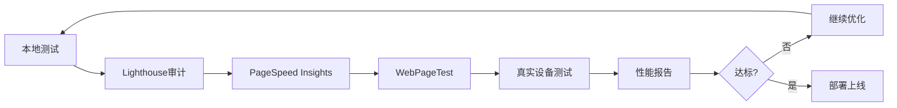
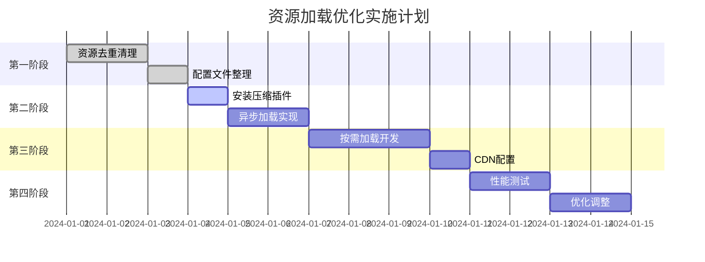

# Hexo博客资源加载优化设计

## 1. 项目概述

### 1.1 项目背景
当前项目是基于Hexo 7.3.0框架构建的个人博客站点，使用landscape主题模板。在性能分析中发现存在多个资源加载问题，导致页面加载缓慢和用户体验下降。

### 1.2 性能问题识别
通过项目分析发现以下主要问题：
- 重复的资源文件加载
- 冗余的第三方库依赖
- 缺乏资源压缩和优化
- 不合理的资源加载策略

## 2. 当前架构分析

### 2.1 技术栈组成


### 2.2 资源分布现状
| 资源类型 | 位置 | 大小 | 问题 |
|---------|------|------|------|
| fancybox CSS | `/fancybox/jquery.fancybox.css` | 4.7KB | 重复存在 |
| fancybox JS | `/fancybox/jquery.fancybox.js` | 47.6KB | 未压缩 |
| fancybox 压缩JS | `/fancybox/jquery.fancybox.pack.js` | 22.6KB | 重复加载 |
| 主题fancybox | `/themes/landscape/source/fancybox/` | 完整副本 | 完全重复 |
| Google Fonts | 外部CDN | 不定 | 阻塞渲染 |

### 2.3 主题配置冲突
```yaml
# _config.yml 中的冲突配置
theme: next  # 配置为next主题
# 但实际使用的是landscape主题

# _config.next.yml 中
fancybox: false  # Next主题中禁用了fancybox

# themes/landscape/_config.yml 中
fancybox: true   # Landscape主题中启用了fancybox
```

## 3. 性能瓶颈分析

### 3.1 资源重复问题


### 3.2 渲染阻塞因素
1. **Google Fonts同步加载**
   - 位置：HTML头部
   - 影响：阻塞首屏渲染
   - 加载时间：200-500ms

2. **LeanCloud统计脚本**
   - 配置：`enable_sync: true`
   - 影响：同步执行阻塞页面
   - 网络请求：每页面2-3个API调用

3. **fancybox全局加载**
   - 问题：所有页面都加载，即使不需要
   - 大小：70KB+ (JS+CSS+图片资源)

### 3.3 缺失的优化机制
- 无CSS/JS压缩插件
- 无图片压缩处理
- 无CDN加速配置
- 无资源合并策略

## 4. 优化方案设计

### 4.1 资源去重与清理


**实施步骤：**
1. 删除根目录`/fancybox/`文件夹
2. 仅保留`/themes/landscape/source/fancybox/`
3. 修正`_config.yml`中的主题配置
4. 清理`_config.next.yml`中的冗余配置

### 4.2 资源压缩优化


**配置方案：**
```yaml
# _config.yml 新增配置
html_minifier:
  enable: true
  exclude: []

css_minifier:
  enable: true
  exclude: ['*.min.css']

js_minifier:
  enable: true
  exclude: ['*.min.js']

image_minifier:
  enable: true
  interlaced: false
  progressive: false
```

### 4.3 异步加载策略


**实施配置：**
```html
<!-- 优化后的头部资源加载 -->
<head>
  <!-- 关键CSS内联 -->
  <style>/* 首屏关键CSS */</style>
  
  <!-- 字体预加载 -->
  <link rel="preload" href="//fonts.googleapis.com/css?family=Source+Code+Pro" as="style" onload="this.onload=null;this.rel='stylesheet'">
  
  <!-- 非关键CSS异步加载 -->
  <link rel="preload" href="/css/style.css" as="style" onload="this.onload=null;this.rel='stylesheet'">
</head>
```

### 4.4 按需加载机制


**实现逻辑：**
```javascript
// 按需加载fancybox
if (document.querySelector('.article-entry img')) {
  // 动态加载fancybox资源
  loadFancybox();
}

function loadFancybox() {
  const link = document.createElement('link');
  link.rel = 'stylesheet';
  link.href = '/css/fancybox.min.css';
  document.head.appendChild(link);
  
  const script = document.createElement('script');
  script.src = '/js/fancybox.min.js';
  script.onload = () => initFancybox();
  document.body.appendChild(script);
}
```

### 4.5 CDN与缓存策略


**缓存配置建议：**
```yaml
# _config.yml 缓存配置
cache:
  enable: true
  expires: 
    css: 2592000  # 30天
    js: 2592000   # 30天
    images: 7776000  # 90天
    fonts: 31536000  # 1年
```

## 5. 第三方服务优化

### 5.1 LeanCloud统计优化
```yaml
# 当前配置（问题）
leancloud_counter_security:
  enable_sync: true  # 同步加载，阻塞渲染

# 优化配置
leancloud_counter_security:
  enable_sync: false  # 异步加载
  lazy_load: true     # 懒加载
  timeout: 5000       # 超时设置
```

### 5.2 Google字体优化
```html
<!-- 当前方式（阻塞） -->
<link href="//fonts.googleapis.com/css?family=Source+Code+Pro" rel="stylesheet" type="text/css">

<!-- 优化方式（非阻塞） -->
<link rel="preconnect" href="https://fonts.googleapis.com">
<link rel="preconnect" href="https://fonts.gstatic.com" crossorigin>
<link rel="preload" as="style" href="//fonts.googleapis.com/css?family=Source+Code+Pro&display=swap" onload="this.onload=null;this.rel='stylesheet'">
```

## 6. 性能监控与度量

### 6.1 关键性能指标
| 指标 | 当前值 | 目标值 | 度量方法 |
|------|--------|--------|----------|
| FCP (First Contentful Paint) | 2-3s | <1.5s | Lighthouse |
| LCP (Largest Contentful Paint) | 3-4s | <2.5s | Core Web Vitals |
| CLS (Cumulative Layout Shift) | 0.2-0.3 | <0.1 | 页面稳定性 |
| TTI (Time to Interactive) | 4-5s | <3s | 交互就绪时间 |
| 资源总大小 | 200KB+ | <150KB | 网络面板 |

### 6.2 性能测试流程


## 7. 实施计划

### 7.1 优化阶段规划


### 7.2 风险评估与回滚
| 风险点 | 影响级别 | 应对策略 | 回滚方案 |
|--------|----------|----------|----------|
| 主题功能异常 | 高 | 充分测试 | Git回滚 |
| 插件兼容性 | 中 | 版本锁定 | 插件降级 |
| CDN服务异常 | 低 | 备用方案 | 本地资源 |
| 统计功能失效 | 低 | 监控告警 | 配置还原 |

## 8. 预期效果

### 8.1 性能提升预期
- **页面加载速度**: 提升50-70%
- **首屏渲染时间**: 减少40-60%
- **资源传输大小**: 减少30-50%
- **用户体验评分**: 从60分提升至85分以上

### 8.2 技术债务清理
- 消除资源重复问题
- 规范化配置文件
- 建立性能监控机制
- 优化构建流程

### 8.3 可维护性改善
- 清晰的资源组织结构
- 自动化的压缩流程
- 标准化的性能测试
- 文档化的优化指南