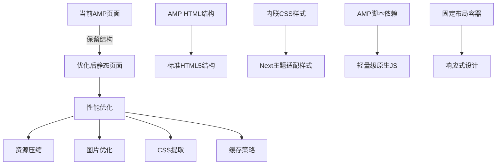

# 个人介绍页面样式与性能升级设计

## 概述

当前 `source/about/index.html` 是一个基于 AMP 技术栈的独立静态页面，包含完整的个人简历信息。该页面结构完整、信息丰富，但在视觉风格、性能表现和与博客主题的一致性方面需要优化。本设计方案将保持独立静态页面的形式，确保信息结构不变，仅进行样式和性能的渐进式升级。

### 现有页面内容分析

**页面结构完整性**
- 顶部悬浮导航栏：包含个人品牌信息和返回博客链接
- 个人信息区块：头像、基本信息、技能标签
- 教育经历：北航硕士、南大本科的详细信息
- 实习经历：腾讯、华融的项目经验
- 项目经历：3个核心项目的详细描述

**设计风格问题**
- 使用固定蓝色主题色 `#4790ef`，与 Next Gemini 主题不协调
- 字体系统独立，未与博客主题保持一致
- 布局容器宽度固定为 `1080px`，缺乏灵活性
- 缺乏暗色模式支持，与博客的 `darkmode: true` 配置不匹配

**性能优化空间**
- 移除不必要的 AMP 框架依赖（8个外部脚本）
- 优化内联CSS结构（当前约400行）
- 实现图片懒加载和资源压缩
- 添加缓存策略和CDN支持

## 架构设计

### 渐进式升级策略



### 页面结构保持

**保留现有信息架构**
- 维持 `source/about/index.html` 文件路径不变
- 保留所有现有内容区块的完整性
- 保持页面的独立性，确保可直接访问
- 维护与博客主站的导航链接

## 样式系统设计

### Next主题风格适配

**基于Next Gemini主题的色彩系统**
```css
/* Next主题兼容的CSS变量 */
:root {
  /* 从Next主题提取的核心色彩 */
  --next-primary: #222;           /* Next主题主色 */
  --next-text: #555;              /* Next主题文本色 */
  --next-background: #fff;        /* Next主题背景色 */
  --next-border: #ddd;           /* Next主题边框色 */
  --next-link: #258fb8;          /* Next主题链接色 */
  --next-shadow: rgba(0,0,0,0.1); /* Next主题阴影 */
}

/* 暗色模式适配 */
@media (prefers-color-scheme: dark) {
  :root {
    --next-primary: #fff;
    --next-text: #c2c2c2;
    --next-background: #1e1e1e;
    --next-border: #3a3a3a;
    --next-link: #4fb3d9;
    --next-shadow: rgba(255,255,255,0.1);
  }
}
```

**布局容器优化**
```css
/* 与Next主题layout保持一致 */
.container {
  max-width: 1200px;  /* 与Next主题内容宽度一致 */
  margin: 0 auto;
  padding: 0 20px;
}

@media (max-width: 767px) {
  .container {
    width: 100%;
    padding: 0 16px;
  }
}
```

### 现有组件优化

**保留现有区块结构，优化样式实现**
```css
/* 个人信息区块优化 */
.person-info {
  background: linear-gradient(135deg, var(--next-primary), var(--next-link));
  color: #fff;
  text-align: center;
  padding: 80px 0 60px;
}

.avator img {
  width: 160px;
  height: 160px;
  border-radius: 50%;
  border: 4px solid rgba(255,255,255,0.2);
  box-shadow: 0 8px 32px rgba(0,0,0,0.3);
  transition: transform 0.3s ease;
}

/* 技能标签优化 */
.tag-list span {
  display: inline-block;
  padding: 8px 16px;
  margin: 4px 8px;
  background: rgba(255,255,255,0.2);
  border: 1px solid rgba(255,255,255,0.3);
  border-radius: 20px;
  font-size: 14px;
  transition: all 0.3s ease;
}
```

## 响应式设计优化

### 保持现有响应式逻辑

```css
/* 优化现有的响应式断点 */
@media (max-width: 767px) {
  .container {
    width: 100%;
    padding: 0 16px;
  }
  
  .education-layout {
    flex-direction: column;
    gap: 24px;
  }
  
  .work-layout {
    flex-direction: column;
  }
  
  .project-item {
    flex-direction: column;
    height: auto;
  }
}
```

## 内容维护策略

### 保持HTML结构，优化维护性

**数据与样式分离**
```javascript
// 将个人信息提取为 JavaScript 对象
const profileData = {
  personal: {
    name: '康彪彪',
    title: '2020年毕业 字节跳动-抖音-全干打杂',
    email: 'kbiao@qq.com',
    blog: 'https://blog.kbiao.me',
    skills: ['Java', 'Spring boot', 'Android', 'GoLang', 'API Gateway', 'Netty', 'Kubernates']
  }
};
```

## 实施计划

### 第一阶段：AMP框架移除（1天）

**目标：移除AMP依赖，保持HTML结构**
1. 移除8个AMP外部脚本引用
2. 将amp-img标签替换为标准img标签
3. 移除AMP特有属性（layout="responsive"等）
4. 保持现有CSS样式和页面结构不变

### 第二阶段：样式系统对齐（1-2天）

**目标：与Next主题视觉一致**
1. 提取关键CSS到独立文件 `source/about/style.css`
2. 修改色彩变量对齐Next主题
3. 添加暗色模式CSS媒体查询支持
4. 优化字体系统使用Next主题字体栈

### 第三阶段：性能优化（1天）

**目标：提升加载性能**
1. 启用hexo-neat插件压缩CSS
2. 实现图片懒加载JavaScript
3. 添加关键CSS内联，非关键CSS延迟加载
4. 配置CDN加速静态资源

### 第四阶段：体验增强（0.5天）

**目标：提升交互体验**
1. 添加平滑滚动效果
2. 优化移动端触摸交互
3. 添加页面加载动画
4. 确保导航链接正常工作

## 性能优化目标

**Core Web Vitals 指标**
- LCP (最大内容绘制): < 2.5秒
- FID (首次输入延迟): < 100毫秒  
- CLS (累积布局偏移): < 0.1

**资源优化指标**
- 页面总大小: < 800KB (当前约1.2MB)
- CSS压缩率: > 30%
- 图片优化: WebP格式，压缩率>50%
- 脚本移除: 减少8个AMP脚本请求

## 技术实现要点

### CSS变量映射
```css
/* 替换现有固定颜色值 */
.person-info {
  background: var(--next-primary, #222); /* 替换#4790ef */
}

.work-more {
  background-color: var(--next-link, #258fb8); /* 替换#00b8e3 */
}
```

### 响应式容器优化
```css
.container {
  max-width: 1200px; /* 从1080px调整 */
  margin: 0 auto;
  padding: 0 20px;
}
```

### 图片懒加载实现
```javascript
// 简单的图片懒加载
const images = document.querySelectorAll('img[data-src]');
const imageObserver = new IntersectionObserver((entries) => {
  entries.forEach(entry => {
    if (entry.isIntersecting) {
      const img = entry.target;
      img.src = img.dataset.src;
      img.removeAttribute('data-src');
      imageObserver.unobserve(img);
    }
  });
});

images.forEach(img => imageObserver.observe(img));
```

## 风险控制

**内容完整性保障**
- 升级前完整备份现有页面
- 分阶段验证每个内容区块
- 确保所有链接和图片路径正确
- 保持原有信息结构不变

**样式兼容性**
- 在测试环境验证暗色模式切换
- 确保在不同设备和浏览器的一致性
- 保持与博客主站的导航连贯性

**性能监控**
- 使用Lighthouse评估优化效果
- 监控页面加载时间变化
- 验证移动端体验改善程度