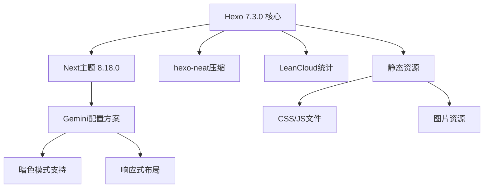
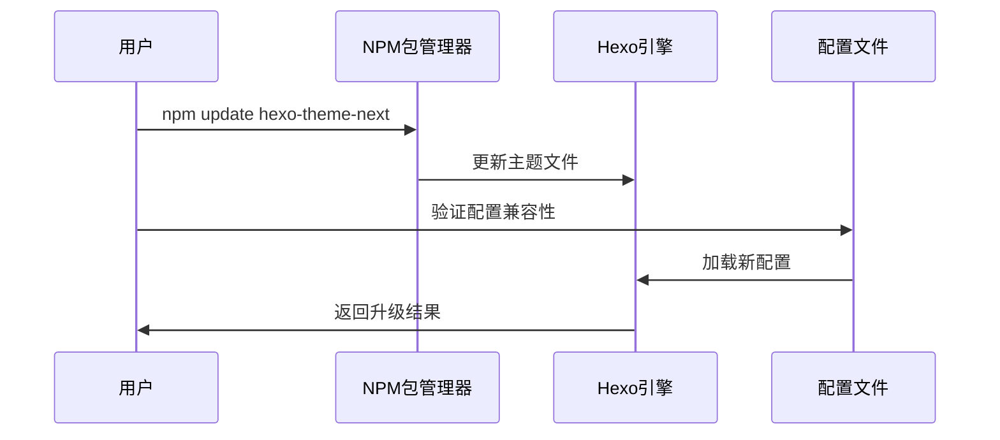
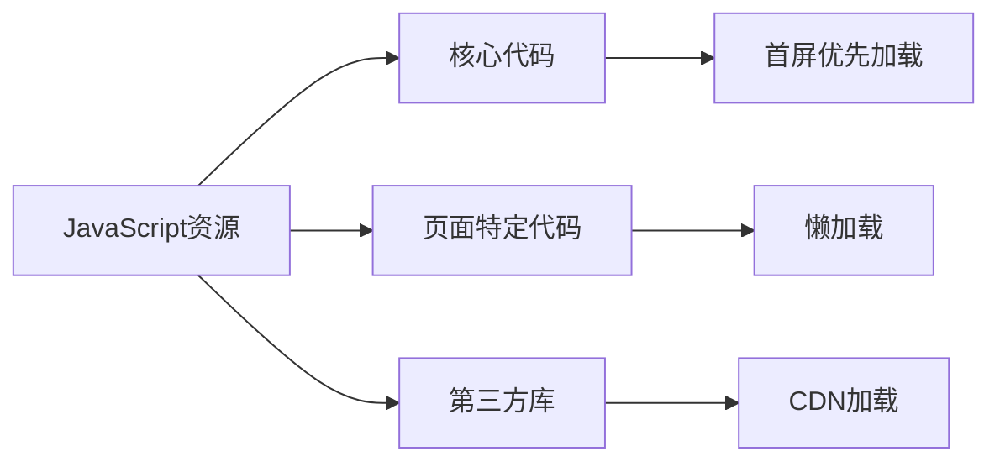
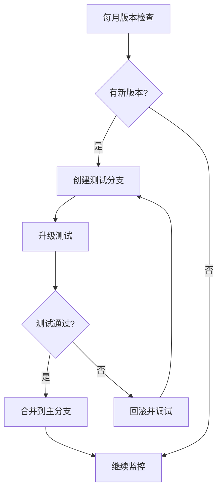

# Hexo Next主题升级与性能优化设计方案

## 概述

### 项目背景
当前项目是基于Hexo 7.3.0的个人博客站点，使用Next主题的Gemini配置方案。项目已安装hexo-neat压缩插件，但在主题版本、性能优化和资源加载等方面仍有提升空间。

### 升级目标
- 升级Next主题到最新版本
- 优化资源加载性能，提升页面响应速度  
- 增强资源压缩和缓存策略
- 改善用户体验和SEO表现

## 技术架构分析

### 当前系统状态

#### 版本信息
- Hexo版本：7.3.0 (已是最新)
- Next主题版本：8.18.0 
- Node.js要求：≥18 (满足Hexo 7.0.0要求)

#### 现有配置特点
- 使用Gemini主题方案，支持暗色模式
- 启用了缓存和压缩功能
- 集成LeanCloud访问统计
- 配置了hexo-neat资源压缩插件



## 升级策略

### 主题升级路径

#### 版本检查与升级
当前Next主题版本为8.18.0，需要升级到最新的8.19.x版本：

```bash
# 检查最新版本
npm outdated hexo-theme-next

# 升级到最新版本
npm update hexo-theme-next
```

#### 配置兼容性验证
升级后需要验证以下配置项的兼容性：

1. **主题配置文件结构**
   - _config.next.yml中的scheme配置
   - 菜单和侧边栏配置
   - 社交链接配置

2. **功能特性配置**
   - 暗色模式设置
   - 缓存和压缩配置
   - 自定义文件路径



### 依赖优化

#### 插件版本升级
当前项目依赖的关键插件升级检查：

| 插件名称 | 当前版本 | 建议版本 | 升级优先级 |
|---------|---------|---------|-----------|
| hexo-renderer-marked | ^6.3.0 | 最新 | 高 |
| hexo-neat | ^1.0.9 | 最新 | 中 |
| hexo-generator-* | ^2.0.0/^3.0.0 | 最新 | 低 |

#### 新增性能插件
建议添加以下插件增强性能：

```json
{
  "hexo-filter-optimize": "^2.0.0",
  "hexo-lazyload-image": "^1.0.9",
  "hexo-offline": "^2.0.0"
}
```

## 性能优化方案

### 资源压缩优化

#### hexo-neat配置增强
当前项目已安装hexo-neat插件，需要在_config.yml中优化配置：

```yaml
neat_enable: true
neat_html:
  enable: true
  exclude: []
neat_css:
  enable: true
  exclude:
    - '*.min.css'
neat_js:
  enable: true
  mangle: true
  output:
  compress:
  exclude:
    - '*.min.js'
```

#### 图片优化策略
实施图片懒加载和压缩：

1. **图片懒加载**
   ```yaml
   # _config.yml
   lazyload:
     enable: true
     onlypost: false
     loadingImg: # loading图片路径
   ```

2. **图片格式优化**
   - 使用WebP格式替代JPEG/PNG
   - 实施响应式图片策略
   - 配置CDN加速

### 缓存策略优化

#### 浏览器缓存配置
通过Next主题的内置功能配置资源缓存：

```yaml
# _config.next.yml
cache:
  enable: true
  
# 静态资源版本控制
version: true
```

#### CDN资源配置
配置第三方库的CDN加载：

```yaml
# _config.next.yml
vendors:
  # 内部路径前缀
  _internal: lib
  # 外部 CDN 设置
  anime: //cdn.jsdelivr.net/npm/animejs@3/lib/anime.min.js
  fontawesome: //cdn.jsdelivr.net/npm/@fortawesome/fontawesome-free@6/css/all.min.css
  jquery: //cdn.jsdelivr.net/npm/jquery@3/dist/jquery.min.js
```

### 加载性能优化

#### 异步加载策略
实施JavaScript和CSS的异步加载：

```yaml
# _config.next.yml
# 预加载策略
preconnect: true

# 异步加载非关键资源
async_loading:
  enable: true
```

#### 代码分割策略
按页面类型分割JavaScript代码：



## 配置实施计划

### 第一阶段：基础升级

#### 升级步骤
1. **备份现有配置**
   ```bash
   # 创建备份分支
   git checkout -b upgrade-backup
   git add -A && git commit -m "备份当前配置"
   
   # 回到主分支进行升级
   git checkout main
   ```

2. **执行升级**
   ```bash
   # 升级Next主题
   npm update hexo-theme-next
   
   # 升级其他依赖
   npm update
   ```

3. **配置验证**
   ```bash
   # 本地测试
   hexo clean && hexo generate
   hexo server
   ```

### 第二阶段：性能优化

#### 配置文件修改

**_config.yml 优化配置**：
```yaml
# 启用hexo-neat压缩
neat_enable: true
neat_html:
  enable: true
neat_css:
  enable: true  
neat_js:
  enable: true

# 优化生成器配置
index_generator:
  path: ''
  per_page: 8  # 减少首页文章数量
  order_by: -date

# 启用缓存
cache: true
```

**_config.next.yml 性能优化**：
```yaml
# 启用压缩和缓存
minify: true
cache:
  enable: true

# 优化资源加载
preconnect: true

# CDN配置
vendors:
  _internal: lib
  fontawesome: //cdn.jsdelivr.net/npm/@fortawesome/fontawesome-free@6/css/all.min.css
  jquery: //cdn.jsdelivr.net/npm/jquery@3/dist/jquery.min.js
```

### 第三阶段：验证与优化

#### 性能测试
使用以下工具进行性能验证：

1. **Google PageSpeed Insights**
   - 测试移动端和桌面端性能
   - 关注FCP、LCP、CLS指标

2. **WebPageTest**
   - 分析资源加载瀑布图
   - 检查缓存策略效果

3. **Lighthouse审计**
   - 性能、可访问性、SEO评分
   - 最佳实践建议

#### 优化指标目标

| 指标 | 当前预期 | 目标值 | 优化手段 |
|------|---------|-------|----------|
| FCP | 2-3秒 | <1.8秒 | 资源压缩、CDN |
| LCP | 3-4秒 | <2.5秒 | 图片优化、缓存 |
| CLS | <0.1 | <0.1 | 布局稳定性 |
| TTI | 4-5秒 | <3.8秒 | 代码分割、懒加载 |

## 监控与维护

### 性能监控
建立持续的性能监控机制：

```yaml
# 添加性能监控插件配置
analytics:
  google_id: # Google Analytics ID
  
# 启用错误监控  
error_tracking:
  enable: true
```

### 版本管理策略
建立定期更新机制：



### 备份策略
确保配置和内容的安全性：

1. **配置文件备份**
   - 定期备份_config.yml和_config.next.yml
   - 使用Git版本控制跟踪变更

2. **内容备份**
   - 文章内容定期备份
   - 静态资源镜像备份

3. **恢复测试**
   - 定期验证备份可用性
   - 建立快速恢复流程